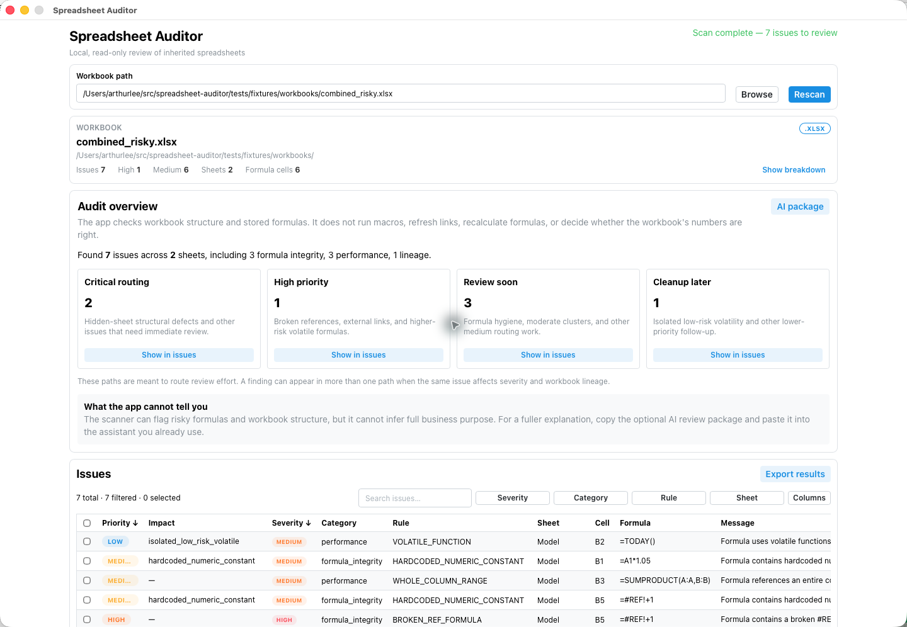
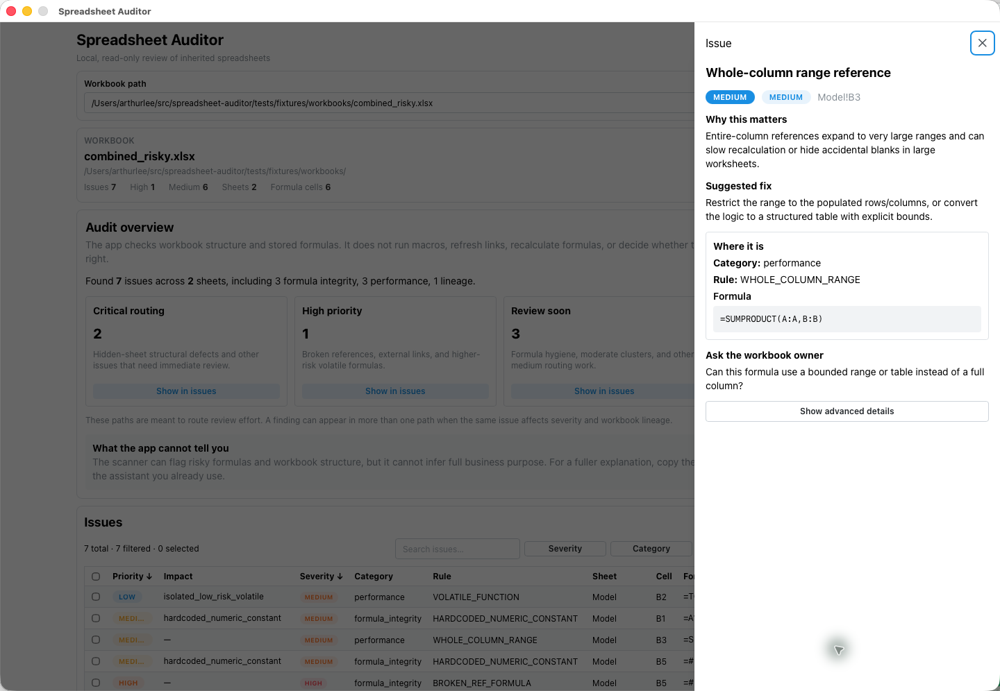
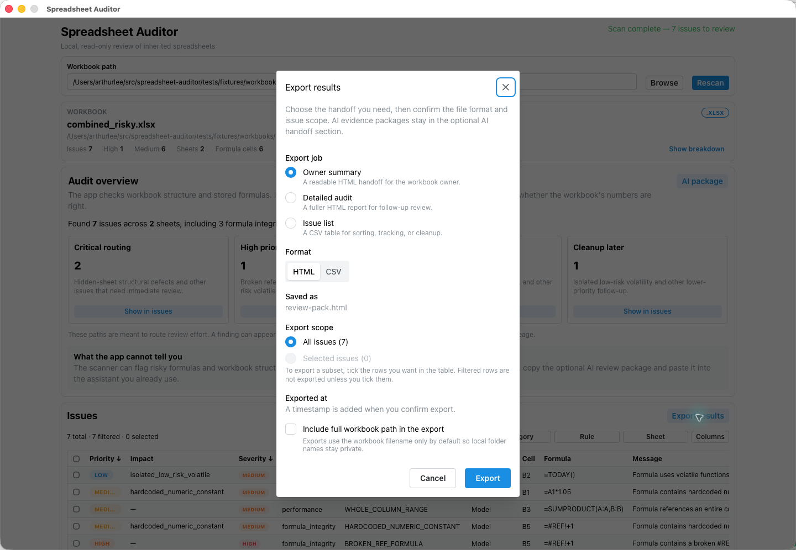
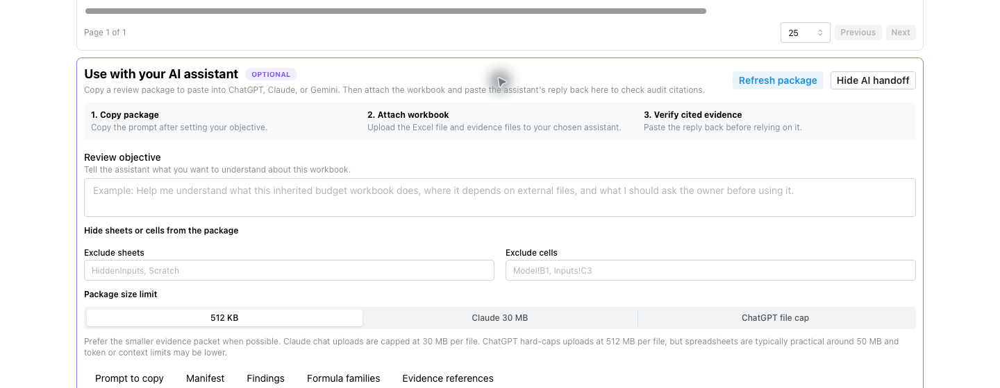

# Spreadsheet Auditor

Local-first workbook review for inherited Excel files.

Spreadsheet Auditor helps analysts review an Excel workbook before they trust
it. It opens the workbook locally, maps sheets and formulas, flags common review
risks, and exports a review package you can share with an owner, manager, or AI
assistant.

Use it when you inherit a workbook and need to answer:

- What sheets, formulas, hidden tabs, and external references are in here?
- Which formulas or workbook areas deserve attention first?
- What should I ask the workbook owner before using this file?
- What evidence can I export for cleanup, sign-off, or a second review?

## What It Does Not Do

Spreadsheet Auditor does not prove the workbook's numbers are correct. It does
not recalculate formulas, run macros, refresh external data, repair formulas, or
save changes back into the workbook. It does not upload your workbook anywhere.

The optional AI handoff does not call ChatGPT, Claude, Gemini, OpenAI, Anthropic,
or a Codex app server. It prepares a grounded evidence package you can copy or
save, use with the assistant you choose, and paste back so the app can check
whether cited audit evidence exists.

## Distribution Status

Signed Mac builds are not posted yet. The app still needs Developer ID signing
and Apple notarization before it is ready for external macOS analyst testers.
Until then, local source builds are for development and Arthur-only testing.

Signing is a packaging step, not a change to how analysis works: the app still
runs locally and does not upload workbooks. If you prefer to wait for a signed
build before opening files, that is reasonable. The packaging checklist is in
[docs/package-readiness.md](docs/package-readiness.md).

## What It Checks Today

The current app checks `.xlsx` and `.xlsm` workbooks for:

- workbook inventory for visible, hidden, and very-hidden sheets
- formula cell counts by sheet
- hardcoded numeric constants in formulas
- volatile function detection
- broken `#REF!` and other Excel error sentinel detection
- whole-column range pattern detection
- external workbook reference detection
- formula-pattern anomaly detection
- derived analyst priority bands and impact factors
- JSON report output
- HTML and CSV review-pack exports for manager-readable triage
- desktop app for scanning, filtering, issue review, export, and optional
  AI-assistant handoff
- manual AI handoff package export and paste-back citation validation

The starting opportunity report lives in
[docs/opportunity-report.md](docs/opportunity-report.md).

## Desktop App Screenshots

These screenshots use the synthetic
`tests/fixtures/workbooks/combined_risky.xlsx` demo workbook. The fixture is
small, but it includes enough review signals to show the normal analyst flow:
priority routing, formula-level issues, export options, and optional AI handoff.



The overview answers the first triage question: how much is in this workbook,
where are the highest-priority findings, and which cells need review first. The
priority cards are routing aids, not proof that the workbook is right or wrong.



Opening an issue shows the exact sheet and cell, the stored formula, why the
rule fired, a practical remediation, and an owner question an analyst can use in
follow-up. The scanner is still static and read-only; it has not recalculated
the workbook.



The export flow lets an analyst create a local owner summary, detailed audit
report, or CSV issue list. Exports use the workbook filename by default so local
folder names stay private unless the user explicitly includes the full path.



The AI handoff is optional. It packages workbook-derived evidence for the
assistant the user chooses, lets the user hide sheets or cells, and asks for a
cited response that can be pasted back into the app for citation checks.

## Using The Desktop App

When you have a packaged app build:

1. Open Spreadsheet Auditor.
2. Choose an `.xlsx` or `.xlsm` workbook.
3. Review the audit overview and priority bands.
4. Open issue details for the cells that need owner review.
5. Export an HTML owner summary, detailed audit report, or CSV issue list.
6. Optionally copy the AI-assistant package, use it with your own assistant,
   and paste the JSON response back to check citations.

Generated review packs are local artifacts. Treat them like workbook-derived
work product and keep them out of version control unless they are intentionally
sanitized.

## Building From Source

The Go analyzer mirrors the Python report contract and passes the committed golden
fixtures:

```bash
go run ./cmd/spreadsheet-auditor scan tests/fixtures/workbooks/combined_risky.xlsx \
  --output /tmp/report.json \
  --review-pack /tmp/review-pack.html \
  --export-csv /tmp/review-pack.csv \
  --exported-at 2026-06-02T12:00:00Z
```

HTML/CSV exports use the workbook basename by default so local folder names are
not leaked. Use `--include-full-path` only when the absolute workbook path is
intentionally part of the review artifact.

Run Go tests and golden verification:

```bash
go test ./...
make verify-goldens
```

Build the desktop app:

```bash
make desktop-build
```

Regenerate frontend bindings after changing `AuditService` methods:

```bash
make desktop-bindings
```

This target removes `desktop/frontend/node_modules` before Wails regeneration;
the next frontend check or build will run a full `npm ci`.

Run in dev mode:

```bash
cd desktop && wails dev
```

The built app is written to `desktop/build/bin/`. See [desktop/README.md](desktop/README.md)
for desktop implementation details.

## Contributor Notes

Prerequisites for full development:

- Go 1.24+
- Node 20+
- [Wails v2.12.0](https://wails.io/) CLI installed in `GOPATH/bin` or available as `wails`
- Python 3.11+ for parity fixtures and contributor checks

Set up the Python parity tooling:

```bash
python3 -m venv .venv
. .venv/bin/activate
python -m pip install -e ".[dev]"
```

Python scripts are for contributors who maintain test fixtures and parity
checks. Analysts using the desktop app do not need Python.

Run the full local gate:

```bash
make check
```

## v0.2 Direction

The v0.2 target is a deterministic local desktop analyzer for finance, audit,
consulting, and operations teams that need fast workbook triage before close,
board reporting, audit review, investor delivery, or client handoff.

See:

- [docs/product-brief.md](docs/product-brief.md)
- [docs/architecture.md](docs/architecture.md)
- [docs/parity-contract.md](docs/parity-contract.md)
- [docs/package-readiness.md](docs/package-readiness.md)
- [docs/signing-distribution.md](docs/signing-distribution.md)
- [docs/release-notes-v0.2.1.md](docs/release-notes-v0.2.1.md)
- [docs/release-notes-v0.2.0.md](docs/release-notes-v0.2.0.md)
