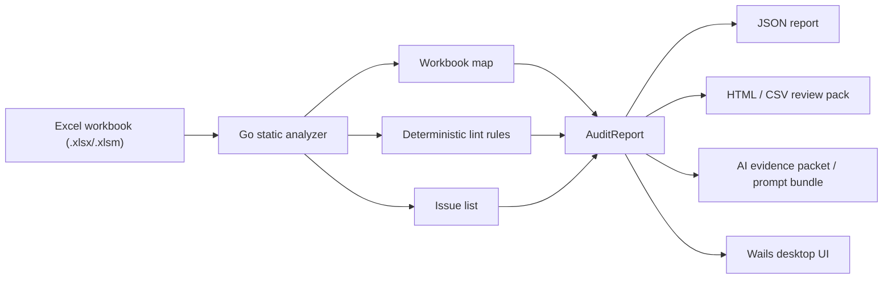
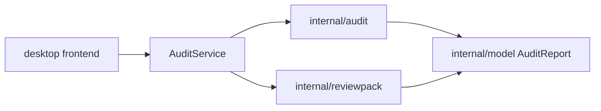

# Architecture

## Current Architecture

## Safety Contract

Default scans are static and read-only:

- no macro execution
- no external link refresh
- no data connection execution
- no formula evaluation
- no workbook mutation

## Runtime Split

Python remains the parity oracle for committed golden fixtures. The shipped CLI
and desktop analyzer path is Go:

- Python uses `openpyxl` and `defusedxml` for the original static analyzer and
  golden fixture generation.
- Go uses Excelize for workbook parsing and `xuri/efp` for formula tokenization
  in the CLI, review-pack exports, evidence packet builder, and Wails desktop
  app.
- The Wails frontend does not duplicate workbook parsing or lint logic.

## Initial Analyzer Flow

1. Load workbook metadata with formulas preserved.
2. Inventory sheets and formula counts.
3. Walk formula cells.
4. Emit deterministic issues from rule functions.
5. Serialize a stable JSON report.
6. Optionally render an HTML review pack from the same `AuditReport` object.

## v0.1 JSON Report Contract

The Python and Go `scan` commands serialize an `AuditReport` object. Top-level
keys are stable for committed fixtures through canonical JSON generation:

| Section | Purpose |
| --- | --- |
| `workbook_path` | Absolute path to the scanned file |
| `supported_format` | Lowercase suffix (`.xlsx` or `.xlsm`) |
| `summary` | Aggregate counts for sheets, formula cells, issues, and issue rollups |
| `sheets` | Per-sheet inventory in workbook order |
| `issues` | Deterministic issue list sorted by sheet, cell, then rule ID |

### Summary

`summary` contains:

- `sheet_count`
- `formula_cell_count`
- `issue_count`
- `issues_by_severity` (keys sorted alphabetically)
- `issues_by_category` (keys sorted alphabetically)

### Sheets

Each sheet entry contains `name`, `state`, `used_range`, and `formula_cells`.

### Issues

Each issue is a self-contained record for reviewers and downstream exports:

| Field | Source |
| --- | --- |
| `rule_id` | Stable identifier used for suppressions and analytics |
| `title` | Short human-readable rule name |
| `severity` | `high`, `medium`, or `low` |
| `category` | Themed grouping such as `formula_integrity`, `performance`, or `lineage` |
| `rationale` | Why the rule exists |
| `remediation` | How to fix or mitigate the finding |
| `message` | Instance-specific description for this cell |
| `evidence` | Exact location payload |
| `details` | Optional rule-specific structured data (keys sorted in JSON) |

`evidence` always includes `sheet` and `cell`. When the finding comes from a formula cell,
`evidence.formula` contains the stored formula text. The workbook path lives on the report
root, not on each issue.

### Rule Registry

Rule metadata is centralized in both runtime models:

- Python: `spreadsheet_auditor.models.RULES`
- Go: `internal/model/rules.go`

Audit code builds issues through those registries so every emitted issue carries
the same title, severity, category, rationale, and remediation. New rules must
be added to the relevant registry before lint code references them.

Current rules:

- `BROKEN_REF_VALUE`
- `BROKEN_REF_FORMULA`
- `EXCEL_ERROR_VALUE` (Go; displayed `#DIV/0!`, `#VALUE!`, `#NAME?`, `#N/A`, `#NUM!`, `#NULL!`, `#SPILL!`, `#CALC!`)
- `EXCEL_ERROR_FORMULA` (Go; formula text contains the same sentinels)
- `EXTERNAL_WORKBOOK_REFERENCE`
- `FORMULA_PARSE_ERROR`
- `FORMULA_PATTERN_ANOMALY`
- `HARDCODED_NUMERIC_CONSTANT`
- `VOLATILE_FUNCTION`
- `WHOLE_COLUMN_RANGE`

## Formula Pattern Anomaly Detection

After per-cell lint rules run, the analyzer groups formula cells on each sheet into
conservative row/column runs and compares position-normalized formula patterns.

### Normalization

The Python parity oracle uses `spreadsheet_auditor.formula_pattern.normalize_formula`
with `openpyxl.formula.Tokenizer`. The Go analyzer uses `internal/formula`
with `xuri/efp` tokenization. Both rewrite cell/range operands relative to the
formula cell:

- Relative references become `R{row_offset}C{col_offset}` offsets from the anchor cell.
- Absolute row/column markers (`$`) are preserved in the normalized token.
- Sheet-qualified references keep their sheet prefix; only the cell/range portion is
  normalized.

Two formulas that differ only because they were copied down/across should produce the
same normalized pattern. Formulas that add literals or change structure (for example
`=A4*B4+100`) produce a different pattern.

### Clustering Heuristic

For each sheet:

1. Build formula cell records with normalized patterns.
2. Find consecutive formula cells in the same column (vertical run) or same row
   (horizontal run). A gap in row/column indices ends the run.
3. Consider only runs with at least three formula cells.
4. Emit one `FORMULA_PATTERN_ANOMALY` issue when a run has exactly one outlier cell
   and every other cell shares the same normalized pattern.

Issue `details` include:

- `cluster_cells`: coordinates in the run
- `cluster_orientation`: `column` or `row`
- `expected_pattern`: normalized majority pattern
- `local_pattern`: normalized pattern for the outlier cell

### Known Limits

- Only 1D row/column runs are considered; rectangular blocks or L-shaped regions are not
  clustered yet.
- Runs require at least three formulas and exactly one local outlier; two-cell pairs and
  multi-outlier disagreements are ignored to limit false positives.
- Normalization is lexical, not semantic: equivalent formulas with different syntax may
  not match, and the engine does not evaluate functions.
- Array formulas, structured table references, and unusual reference syntax may not
  normalize; those cells are skipped for clustering when tokenization fails.
- A cell is reported at most once even if it is an outlier in both a row and column run.

### Ordering And Determinism

- Issues sort by `(sheet, cell, rule_id)`.
- `details` object keys sort alphabetically during serialization.
- CLI JSON uses `sort_keys=True` for stable file diffs.

## HTML Review-Pack Export

The `scan` command accepts `--review-pack PATH` to write a manager-readable HTML
artifact from the in-memory `AuditReport`. JSON (`--output`) and HTML can be written in
the same run.

`spreadsheet_auditor.review_pack.render_review_pack_html` builds the document from report
fields directly (not by re-reading CLI JSON). All workbook-provided strings—paths, sheet
names, formulas, messages, and remediation text—pass through `html.escape` before
interpolation. The export does not embed scripts, iframes, or executable content.

### Review-Pack Sections

| Section | Content |
| --- | --- |
| Workbook summary | Path, format, sheet count, formula cell count, issue count |
| Issues by severity | Counts keyed by severity (sorted alphabetically) |
| Issues by category | Counts keyed by category (sorted alphabetically) |
| Sheet inventory | Name, visibility state, used range, formula cell count |
| Issues table | Severity, category, rule, sheet, cell, formula, message, remediation |

### CLI Flags

| Flag | Output |
| --- | --- |
| `--output`, `-o` | Deterministic JSON (`sort_keys=True`, indented) |
| `--review-pack` | HTML review pack |
| (none) | JSON to stdout when no file flags are set |

### Determinism And Safety

- HTML issue rows follow the same `(sheet, cell, rule_id)` ordering as JSON issues.
- Rollup tables sort keys alphabetically; repeated renders of the same report are byte-stable.
- Generated `audit-report*.html` and `review-pack*.html` files are gitignored by default.

## Go Review-Pack Export

The Go CLI mirrors Python `scan` flags: `--output` / `-o` for JSON,
`--review-pack` for HTML, and `--export-csv` for CSV. Both export formats accept
`--exported-at RFC3339` for deterministic output in tests.

`internal/reviewpack` renders from the in-memory `AuditReport`:

- `RenderHTML(report, exportedAt, workbookIdentity)` matches the Python section
  layout, escapes workbook-provided strings with `html.EscapeString`, and lets
  exports use basename-only workbook identity unless full path is explicitly
  opted in.
- `WriteCSV` uses Go `encoding/csv` with a fixed header order, canonical
  `details_json`, and CSV injection mitigation for Excel-opened values.
- `ExportOptions` supports optional `issue_id` selection
  (`rule_id|sheet|cell|message|suffix`) filtered server-side. The suffix is a
  short deterministic hash of formula/details evidence to avoid same-cell
  collisions while keeping IDs readable.

`AuditService.SaveExport` is the Wails entry point; `SaveReviewPack` remains a
deprecated HTML wrapper for one release.

The desktop export modal adds a workflow-level job selector:

- Owner summary: defaults to HTML for workbook-owner handoff.
- Detailed audit: defaults to HTML for follow-up review.
- Issue list: defaults to CSV for sorting, tracking, or cleanup.

All three jobs currently route through `SaveExport`; the job choice controls the
recommended/default format rather than a separate backend report template.

## Wails v2 Desktop Shell

The desktop app under `desktop/` wraps the Go analyzer with Wails v2.12.0. It
imports `spreadsheet-auditor/internal/audit` and `internal/reviewpack` directly;
there is no Python bridge and no duplicated lint logic in the UI layer.

`AuditService` exposes `ScanWorkbook`, `BuildAIHandoff`,
`ValidateUnderstandingReport`, `SaveUnderstandingReport`, `RenderReviewPack`,
`SaveExport` (HTML or CSV with optional selected issue IDs and full-path
opt-in), deprecated `SaveReviewPack`, JSON save helpers, and file dialogs for
workbook selection and export paths. The frontend shows the audit overview, summary rollups,
filterable issues table, issue detail drawer, export modal, and optional
AI-assistant handoff panel.

`make desktop-bindings` regenerates Wails bindings and removes
`desktop/frontend/node_modules`; the next frontend check or build performs a
fresh `npm ci`.

## LLM Evidence Packet V1

`internal/evidence.BuildPacket` derives an `EvidencePacketV1` from the existing
`AuditReport`. This packet is a reviewer-grade context artifact for manual LLM
use and future provider integrations; it is not part of deterministic issue
detection.

The packet includes:

- `packet_version: "1"` and `audit_hash` derived from canonical audit JSON with
  `workbook_path` normalized to `<workbook>` so the hash does not vary by local
  filesystem path
- workbook basename only, never the absolute workbook path
- workbook summary and sheet summaries from the deterministic scan
- audit findings with issue ID, rule ID, severity, exact sheet/cell evidence,
  formula text when already present in issue evidence, rationale, and remediation
- formula-family entries for deterministic formula-pattern anomaly issues
- a citation map containing valid `issue_id`, `rule_id`, `sheet!cell`,
  `formula_cluster_id`, and sheet-name citations

The packet does not include raw workbook bytes, VBA bytes, full sheet dumps, or
general cell-value dumps. Issue `details` are projected through an explicit
allowlist before packet output so future analyzer rules cannot accidentally
smuggle broad cell values into LLM context. Prompt bundle options add redaction,
exclusions, and capped workbook slices, but workbook slices remain disabled by
default and separate from deterministic scan behavior.

## Prompt Bundle V1 (Slice 2)

`internal/promptpack` prepares redacted, exclusion-aware evidence for manual LLM
use. `BuildAIHandoff` on `AuditService` scans once and returns aligned prompt
text, evidence packet JSON, prompt bundle JSON, and the structured bundle for UI
preview. `BuildPromptBundle`, `BuildEvidencePacketJSON`, and
`BuildPromptBundleJSON` remain for compatibility and route through the same
single-report builder. `SaveEvidencePacket` / `SavePromptBundle` apply the same
`PromptBundleOptions` so preview, copy, and save stay aligned.

`PromptBundleV1` includes:

- `bundle_version` and `prompt_version` pins
- deterministic `instructions` with untrusted-data delimiters
  (`<<<EVIDENCE_PACKET_UNTRUSTED_BEGIN>>>` / `<<<EVIDENCE_PACKET_UNTRUSTED_END>>>`)
- embedded `evidence_packet` JSON after redaction and exclusions
- `response_schema` describing `UnderstandingReportV1`
- assembled `prompt` text for copy/export

Redaction defaults remove absolute/local paths, URI-like external paths,
connection-string-like values, and obvious secret-like key/value patterns from
packet strings and allowlisted issue `details`. Sheet exclusion uses exact sheet
names; cell exclusion uses exact `sheet!cell` citations. Workbook slices remain
off unless `enable_workbook_slices` is set; caps apply via
`max_slice_rows`, `max_slice_columns`, and `max_packet_bytes`.

`BuildEvidencePacket` without options still returns the raw Slice 1 packet from
`evidence.BuildPacket` so committed packet goldens stay stable.

`UnderstandingReportV1` is the structured answer shape expected from an LLM:

- `workbook_purpose`
- `sheet_roles`
- `key_flows`
- `major_risks`
- `cleanup_plan`
- `owner_questions`
- `confidence_notes`

Every claim section carries citations that must resolve against the packet
citation map. `internal/evidence.ValidateUnderstandingJSON` rejects missing
required sections, unsupported top-level sections, malformed JSON, and citations
not present in the packet map. Rejected LLM output must not be rendered as
grounded deterministic findings.

## Desktop Understanding UI (Slice 3)

After a successful scan, the desktop app shows an optional **Use with your AI
assistant** handoff panel (separate from the deterministic issues table) that:

- builds preview content from `BuildAIHandoff(path, PromptBundleOptions)` (one
  backend scan per open/refresh)
- accepts exact sheet-name and `sheet!cell` exclusions via text fields
- exposes preview tabs for manifest, findings, formula families, citation map,
  and assembled prompt text
- copies or saves the same bundle/packet payloads used for preview
- validates pasted `UnderstandingReportV1` JSON through
  `ValidateUnderstandingReport`
- saves the verified AI analysis as JSON and copies it as Markdown only after
  cited evidence resolves
- renders validated LLM sections only when citations resolve to packet entries;
  accepted UI copy states that claim substance still needs human review.
  Rejected JSON or fabricated citations stay in a dedicated rejected state

Deterministic `report.Issues` and severities are never mutated by LLM paste-back.

Build and dev commands are documented in `desktop/README.md` and the root
`README.md` (`make desktop-bindings`, `make desktop-build`, `wails dev`).

The desktop app now carries the v0.2 package identity used for signing and
notarization planning:

- product name: `Spreadsheet Auditor`
- bundle identifier: `com.fynellc.spreadsheet-auditor`
- output executable: `spreadsheet-auditor-desktop`
- product version: `0.2.1`

The certification path mirrors the prior Gongctl Desktop pattern: keep source in
git, build locally, Developer ID sign with hardened runtime, submit to Apple
notarization, staple the accepted ticket, validate with `codesign`, `spctl`, and
`xcrun stapler`, then attach the zipped app bundle to a GitHub Release.

## Go Conversion Parity Gate

Python remains the parity oracle after the Go port. Synthetic workbook fixtures
under `tests/fixtures/workbooks/` and canonical JSON goldens under
`tests/fixtures/golden/` are generated by `scripts/emit_goldens.py`.

- `make regenerate-goldens` rebuilds fixtures and goldens.
- `make verify-goldens` fails when generated output drifts from committed files.
- `tests/test_golden_parity.py` compares normalized JSON bytes for every fixture.

See `docs/parity-contract.md` for normalized `workbook_path`, lexical issue ordering,
sheet states, external-reference behavior, and other locked semantics.

## Near-Term Design Requirements

- Rule IDs must remain stable across releases.
- Suppressions should bind to rule ID plus stable cell/range identity from `evidence`.
- Exports should be generated from the same `AuditReport` object as CLI JSON.
- The formula anomaly engine should normalize formulas relative to their cell position before clustering.

## Known Format Boundaries

Supported first:

- `.xlsx`
- `.xlsm` as static XML, without macro execution

Deferred:

- `.xlsb`
- password-protected files
- legacy `.xls`
- live Excel COM inspection
- Office add-in navigation
