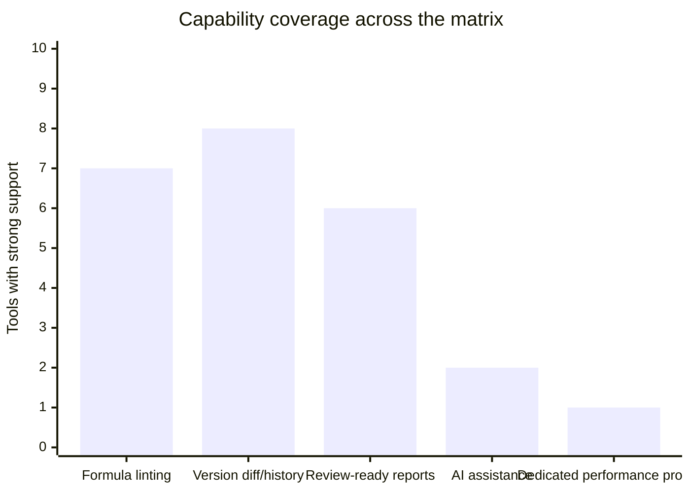
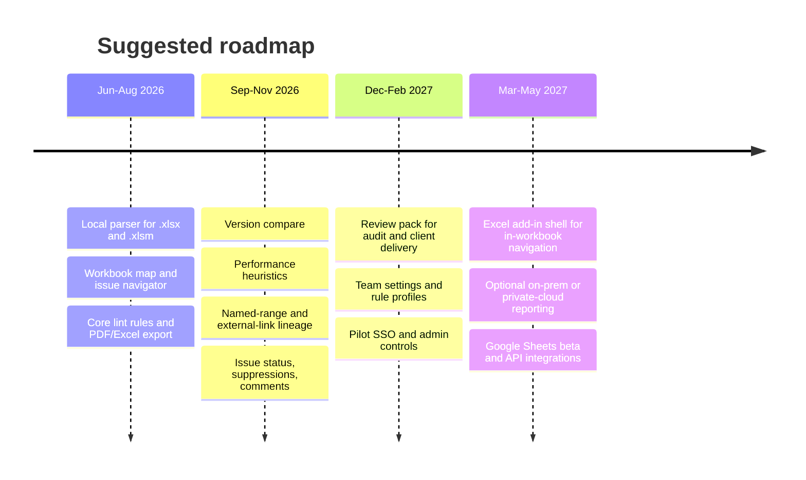

# Spreadsheet Auditor App Opportunity Report

## Executive summary

Yes, a spreadsheet-auditor app is viable, and the core pain is real. The evidence is strongest not for a generic "AI spreadsheet assistant," but for a deterministic reviewer that helps professionals understand inherited workbooks, catch formula mistakes, surface performance risks, and produce sign-off-ready review artifacts. Research literature has long found that spreadsheet errors are common and non-trivial, and hard to detect reliably. Operational spreadsheet audits, literature reviews, and survey papers all point in the same direction: real business spreadsheets frequently contain meaningful errors, and review remains burdensome. citeturn12search0turn12search2turn12search3turn12search13

The market is crowded, but fragmented. Existing products tend to cluster into five buckets: audit add-ins such as PerfectXL, OAK, Spreadsheet Detective, Arixcel, and CIMCON; built-in Microsoft tools such as Inquire and Spreadsheet Compare; AI copilots in Excel and Google Sheets; version control and diff tools such as xltrail and Git XL; and a small wave of lightweight web tools such as Excel Risk Check. What is still uncommon is one product that combines deterministic linting, workbook-map discovery, performance diagnostics, change review, and review-readiness artifacts in a privacy-preserving package priced for teams rather than only enterprise control functions. citeturn34view0turn35view0turn18search0turn19search0turn36view0turn37view0turn20search2turn33view4turn27search0

The best initial wedge is not "replace Excel" and not "AI writes formulas for you." It is: **review unfamiliar Excel files quickly and confidently before close, audit, board reporting, investor delivery, or client handoff**. That positioning aligns with what users complain about in forums, what Microsoft's built-ins still do not automate fully, and what direct competitors only partially cover. Microsoft's own documentation still says there is **"no automatic way to find all workbook links in a workbook,"** which is a surprisingly strong signal that pain remains open despite native features. citeturn30view0

My recommendation is to build a **local-first Excel reviewer** with three differentiators: a deterministic formula lint engine, a static performance-profiler based on Excel's own optimization guidance, and an exportable review pack that makes issue lists and risk summaries easy to share. Add AI later as an explanation layer, not as the decision engine and not as the default editor of formulas. Microsoft Copilot and Google Gemini are already strong at formula creation and data insights, but their official positioning is not workbook-wide linting, deterministic risk scoring, or audit-style review workflows. citeturn36view0turn36view1turn37view0turn37view1

## Demand and user pain

The underlying problem is stable and broad: spreadsheets are still a major execution layer for finance, audit, consulting, and last-mile analytics. In the United States alone, the occupation counts adjacent to the most likely paid users are large: about 1.58 million accountants and auditors, 429,000 financial analysts, 1.08 million management analysts, 245,900 data scientists, and 50,400 budget analysts. Not all are spreadsheet-heavy, but even a conservative share yields a large practical user base. citeturn16view0turn16view1turn16view2turn15view3turn16view3

The nature of the work also matches the product thesis. Accountants and auditors examine financial records; financial analysts evaluate financial data; management analysts work under tight deadlines to improve efficiency; data scientists translate data into business recommendations. All are plausible users of a tool that shortens workbook review, isolates risk, and makes review findings portable. citeturn15view0turn15view1turn15view2turn15view3

### Target personas

| Persona | Core job to be done | Acute pains | Why they would pay |
|---|---|---|---|
| FP&A and finance model owners | Review monthly forecast, budget, board pack, planning model | Inherited files, manual overrides, opaque formulas, broken external links, slow recalculation | Faster pre-close checks, fewer embarrassing errors, better handoff confidence |
| Internal and external auditors | Assess workbook integrity and evidence quality | Need repeatable review, issue logs, comparables, traceability, sign-off artifacts | Standardized review process, exportable evidence, reduced manual checking |
| Consultants and fractional CFO teams | Triage unfamiliar client workbooks under deadline | Hardcoded numbers, inconsistent formulas, version differences, poor documentation | Shorter ramp-up time, diff visibility, client-ready reports |
| Data and operations teams using Excel as a last-mile tool | Understand workbook logic around inputs, transforms, and outputs | External dependencies, hidden sheets, expensive formulas, "shadow IT" spreadsheets | Lower operational risk, less firefighting, better transition to governed systems |

This persona mix is also reflected in how competitors position themselves. PerfectXL explicitly targets controllers and model reviewers; OAK pitches financial modelers and reviewers; CIMCON targets banking, insurance, and IT audit/control functions; xltrail emphasizes regulated financial and insurance organizations. citeturn34view2turn25search2turn35view5turn20search2

### What users are actually asking for

The most consistent forum demand is not for "more AI." It is for faster triage of messy, inherited workbooks and simpler ways to spot hidden risk.

> "Hardcoded Figures ... Don't make me go on a treasure hunt." citeturn9search2

> "reviewing a excel model that is often just freezing ... around 500k formulas" citeturn9search9

> "riddled with obsolete links, REF! errors ... tracing formulas a near impossible task" citeturn10search14

> "need to see the difference from last week's data set" citeturn31search19

Those complaints line up tightly with the product opportunity: hardcoded-value detection, external-link mapping, formula inconsistency analysis, and workbook performance diagnostics. They also line up with Microsoft's own help pages, which devote significant space to broken workbook links, unsafe external content, and performance obstructions caused by volatile functions, whole-column references, SUMPRODUCT misuse, INDIRECT, and oversized ranges. citeturn30view0turn28view2turn29view0turn29view1turn29view3turn29view4

There is also evidence that built-in Microsoft functionality is under-discovered and partly constrained by edition and platform rules. Official support states that Spreadsheet Compare is available only in Excel for Windows in specific enterprise editions, and user forum posts still show confusion about where to find it. That means the market has both a pain gap and a discoverability gap. citeturn19search2turn18search8turn19search7turn19search9

### Why this pain persists

Three reasons keep resurfacing. First, spreadsheet quality problems are highly local and contextual: a workbook may "work" while still embedding hardcoded assumptions, inconsistent copied formulas, hidden dependencies, or expensive volatile functions. Second, most existing tools solve one part of the workflow, not the whole. Third, review often happens under deadline pressure, which raises the value of deterministic automation and issue prioritization. Research on spreadsheet errors and newer work such as ExceLint reinforce that irregular formulas and local disruptions in repeated regions are a meaningful signal for bug-finding, which is exactly the kind of pattern a lint engine can exploit. citeturn12search0turn12search2turn32search11turn32search14

## Competitive landscape

The direct market is active but segmented. Audit add-ins are the most mature category. PerfectXL, OAK, CIMCON, Arixcel, and Spreadsheet Detective all offer some combination of formula inspection, consistency checking, workbook visualization, comparison, and reporting. Microsoft includes Inquire and Spreadsheet Compare for some enterprise users, which lowers the "basic audit" entry barrier. AI assistants from Microsoft and Google focus on formula creation, understanding, data insights, and edits, but they do not present themselves as formal linting or sign-off systems. Version-control tools such as xltrail and Git XL solve history and diff pain well, but not audit heuristics. citeturn34view0turn25search2turn35view5turn5search1turn26search2turn18search0turn19search0turn36view0turn37view0turn20search2turn33view4

Adjacent enterprise buyers may also choose governance platforms rather than formula tools. Apparity and Mitratech ClusterSeven emphasize EUC inventory, controls, discovery, and risk management across spreadsheets and other end-user computing assets. That matters because some large buyers will treat spreadsheet audit as a control problem, not just a spreadsheet-UX problem. citeturn8search1turn8search2turn8search7

### Competitor matrix

| Tool | Features | Deployment | Pricing | Target customers | Strengths | Weaknesses | Primary sources |
|---|---|---|---|---|---|---|---|
| PerfectXL | Risk analysis, improvement suggestions, auditing, formula consistency, compare, PDF reports | Excel add-in / desktop suite | From €69 per month for a single tool | Controllers, model reviewers, audit/advisory, finance pros | Broad audit suite, strong reports, polished positioning | Commercial and Excel-centric; performance profiling not a core public message | citeturn34view0turn34view1turn34view2turn23view3 |
| CIMCON XLAudit | 60 audit criteria, 50+ sensitivity/vulnerability tests, compare, lineage, permissions, scheduled audits, GRC integration | Excel plug-in plus enterprise EUC platform | Unspecified publicly; demo/free trial | Banking, insurance, IT audit, controls, model risk | Strong enterprise controls and lineage | Likely heavy-weight for small teams; opaque pricing | citeturn35view5turn35view0 |
| Microsoft Inquire and Spreadsheet Compare | Workbook analysis, relationships, warnings, compare formulas/values/formatting/VBA, export analysis | Windows Excel; specific Microsoft 365 enterprise-equivalent editions | Bundled; standalone pricing unspecified | Existing Microsoft enterprise users | Built-in, familiar, effective diff and relationship views | Windows-only, edition-limited, limited proactive linting/perf workflow | citeturn18search0turn19search0turn19search1turn19search2 |
| Microsoft Copilot in Excel | Create and understand formulas, insights, charts, PivotTables, filters, edits in workbook | Cloud-backed in Excel desktop/web/mobile | $18/user/month annual or $25.20 monthly commitment, plus qualifying Microsoft 365 plan | Microsoft 365 business/enterprise users | Strong natural-language assistance and analysis | Not positioned as deterministic workbook auditor; requires supported range/table and AutoSave | citeturn36view0turn36view1turn36view2turn36view4turn23view2 |
| Google Gemini in Sheets | Create tables/formulas, fix formula errors in some tiers, AI columns, analysis, charts, side panel | Cloud in Google Sheets | Requires eligible Workspace/AI plan; public business pricing unclear in reviewed sources; education add-on $20 to $24/user | Google Workspace users | Strong in-sheet AI workflow; low friction for Sheets-native teams | Sheets-first, some features experimental, not positioned as audit-grade control/reporting layer | citeturn37view0turn37view1turn37view2turn38view4 |
| Operis OAK | 30+ tools, workbook summary, risk/complexity, map, formula explorer, formula reconstruction, version comparison | Excel add-in / desktop | Annual subscription £311.66 | Financial model builders, reviewers, auditors | Deep review tooling, strong finance-model niche credibility | Professional niche; collaboration and workflow thinner than governance platforms | citeturn25search2turn5search0turn25search5 |
| Arixcel Explorer | Workbook/worksheet/block compare, navigation, Excel COM add-in plus XLL | Windows desktop Excel | £2.75 per user-month | Excel power users, finance users | Very affordable, focused compare/navigation | Narrower scope, Windows-only, lighter reporting/governance | citeturn5search1turn5search5turn5search7 |
| Spreadsheet Detective | Formula audit suite, compare spreadsheets, workbook reports, formula maps, optional compliance metadata/governance layer | Excel add-in; optional cloud metadata in Compliance Detective | Annual licensing; public current price specifics not obvious from reviewed official pages | Spreadsheet professionals, model risk and compliance teams | Long-established and feature rich | Older product feel likely; pricing is less transparent than self-serve SaaS | citeturn26search2turn26search3turn26search0turn26search5 |
| xltrail and Git XL | Version history, sheet/VBA diffs, audit trail, Git integration; Git XL gives local open-source diff for workbook files with VBA | xltrail cloud or self-hosted; Git XL local open-source | xltrail $35/user/month paid yearly; Git XL free/open-source | Regulated spreadsheet teams, dev-heavy finance/quant users | Best-in-class change history and diff story | Not formula linting or performance profiling | citeturn20search2turn23view5turn33view4 |
| Excel Risk Check | Free online analysis, formula validation, circular refs, volatile function flags, hidden element inventory, risk scoring, paid PDF reports | Web / cloud upload | Free analysis; PDF reports $5; enterprise unspecified | Finance teams, analysts, lightweight buyers | Very low friction, explicit review outputs, deterministic score | Upload/privacy barrier for enterprises; newer and less proven than incumbents | citeturn27search0turn27search2turn27search3turn7search6 |

A narrower adjacent set also exists outside the table. FormulaSpy is a relatively focused formula-debugging add-in priced at $44 per user per year, which is useful evidence that lightweight, affordable formula tooling does sell, but it is narrower than a full spreadsheet-review product. citeturn23view6turn21search9

The chart above is a conservative synthesis of the official feature pages in the matrix, not vendor-supplied data. The gap that stands out is performance profiling. Many tools can compare, visualize, or highlight; very few clearly market a dedicated, Excel-aware diagnosis of recalculation bottlenecks. That whitespace is reinforced by Microsoft's own documentation on volatile functions, whole-column references, INDIRECT, array formulas, and link/reference obstructions. citeturn29view0turn29view1turn29view3turn29view4

## MVP positioning and roadmap

### Recommended MVP positioning

**A local-first review assistant for inherited Excel workbooks.**  
The job is simple: open a workbook, find the highest-risk issues fast, explain why they matter, and export a review pack for sign-off.

That wedge is better than a broad "spreadsheet AI copilot" for four reasons. It targets urgent, recurring pain; it avoids fighting Microsoft and Google head-on on generic AI assistance; it fits privacy-sensitive teams; and it combines categories that are still fragmented across the market. The strongest headline is not "write formulas for me." It is "review unfamiliar Excel files in minutes, not hours." citeturn9search2turn10search14turn30view0turn36view0turn37view0

### Must-have feature set for v0.1

A strong v0.1 should be intentionally opinionated and deterministic.

| Core area | What v0.1 should do |
|---|---|
| Workbook map | Inventory sheets, hidden and very-hidden content, named ranges, external links, data connections, formulas vs values by region |
| Formula linting | Flag hardcoded constants inside formulas, inconsistent copied formulas, broken references, suspicious blanks/errors, volatile functions, risky constructs such as INDIRECT/OFFSET, whole-column array patterns, and unusually complex formulas |
| Performance profiler | Use static heuristics to rank likely bottlenecks: volatile functions, array formulas over large ranges, whole-column SUMPRODUCT, repeated expensive lookups, used-range bloat, excessive external-link usage |
| Change review | Compare two workbook versions and classify changes into formula/value/format/link/named-range categories |
| Review-readiness | Severity scoring, issue status, comments, suppressions, PDF/Excel export, and a concise risk summary for managers or auditors |
| Explainability | For each issue, show exact cells, rule triggered, reason, and safe remediation suggestion |
| Privacy | Default local processing; no upload required |

This scope is technically aligned with both the research and Excel's own guidance. Research such as ExceLint shows that adjacent-formula similarity and disruptions in repeated regions are useful for automatically finding formula errors. Excel's performance documentation provides a ready-made rulebook for the initial performance profiler. citeturn32search11turn32search14turn29view0turn29view1turn29view3turn29view4

### What should wait for the roadmap

Items that matter, but should not block launch: automated fixes, Google Sheets parity, multi-user workflow, policy packs for regulated environments, deeper model-risk controls, and cloud collaboration. AI-generated repair suggestions are useful, but only after the deterministic core earns trust.

### What not to do first

Do not begin with broad autonomous editing. Microsoft's own Copilot documentation highlights that it can work directly in the document and make changes live. For an audit-oriented product, that is the wrong trust posture for day one. The safer path is read-only analysis first, then optional fix proposals with explicit preview and user acceptance. citeturn36view2

## Technical feasibility and security

### Feasibility and architecture options

This product is technically feasible with existing file and formula tooling. On the file side, openpyxl can read and write Excel 2010 xlsx/xlsm/xltx/xltm files, Apache POI provides Java APIs for Excel and explicit formula parsing into tokens, and the `formulas` project can parse and execute Excel formulas without Excel itself. On the integration side, Office Add-ins run across Windows, Mac, iPad, and the web, and Microsoft supports centralized deployment for organizations. citeturn28view6turn33view0turn33view1turn28view7turn28view5turn33view2

Three architecture patterns make sense:

| Option | Pros | Cons | Best use |
|---|---|---|---|
| Local desktop analyzer | Strong privacy, deep file access, best for heavy parsing and large files | Separate UX from Excel, packaging burden | Best initial engine |
| Office add-in only | In-flow UX, cross-platform, centralized deployment, AppSource path | Sandbox and API limits make raw file parsing and deep analysis harder | Best shell, not best heavy engine |
| Hybrid local engine plus Office add-in | Combines privacy and deep parsing with in-workbook navigation | More engineering complexity | Best long-term architecture |

My recommendation is the hybrid model, but phased. Start with a **local desktop analyzer** that opens files directly and exports review packs. Add an **Excel task-pane shell** later so reviewers can jump to flagged cells inside Excel. That preserves a local-first trust story while giving users the "feel native" experience they want. citeturn28view5turn33view2turn33view3

### How the core analyzer should work

The core engine should be deterministic. Parse workbook structure, build a dependency graph, normalize formulas into a relative pattern representation, cluster nearby formulas, and flag outliers. That approach matches the academic direction of ExceLint and older irregularity-detection work, and it avoids the brittleness of relying on LLM judgment for first-pass risk classification. citeturn32search11turn32search14turn32search25

For performance diagnostics, the first release does not need runtime profiling hooks. Static detection will go a long way: OFFSET and INDIRECT because they are volatile, whole-column references in array contexts, SUMPRODUCT over huge ranges, repeated external links, oversized used ranges, hidden-sheet sprawl, and deeply nested formulas. Excel's own optimization guidance gives a concrete ruleset for these heuristics. citeturn29view0turn29view1turn29view3turn29view4

### Privacy and security considerations

This category is unusually sensitive. Excel workbooks often contain financial data, personally identifiable information, regulated reporting, external links, macros, and other active content. Microsoft explicitly warns that some macros can introduce malware, and that automatically updating workbook links or enabling external content can be harmful if the source is untrusted. citeturn28view3turn28view2

That has two implications for product design. First, the default mode should be **static analysis only**: never execute workbook macros, never refresh external links, and never trust data connections during analysis. Second, local-first should be the default deployment posture. A cloud upload path can exist later, but it should be optional, with strong deletion guarantees, customer-controlled retention, and ideally on-prem or private-cloud deployment for larger organizations. The security case for local-first is further strengthened by Google's own experimental Sheets documentation, which says prompts, generated content, and Workspace content used for generation may be collected and stored in some Gemini workflows. citeturn28view2turn28view3turn37view0

If you later ship an Office add-in, Microsoft's platform helps. Office Add-ins run in isolated runtimes with governed resource use, sandboxing in web clients, and Marketplace requirements such as SSL and a compliant privacy policy. That does not remove enterprise review friction, but it is a credible security baseline. citeturn28view4turn28view5

One engineering footnote matters: if you use openpyxl or similar XML-based readers, account for XML-parser security. The openpyxl docs explicitly say it does not guard against certain XML expansion attacks by default and recommends `defusedxml`. citeturn28view6

## Market opportunity and go-to-market

### Qualitative market size and rough TAM/SAM

The broad spreadsheet universe is enormous, but the paid wedge is narrower. The core buyer is not every Excel or Sheets user. It is the subgroup whose work repeatedly involves unfamiliar, important, or regulated workbooks. Using U.S. occupation counts as a rough anchor, the immediately adjacent pool is about 3.38 million workers across accountants/auditors, financial analysts, management analysts, data scientists, and budget analysts. Assuming only 60 percent are truly spreadsheet-heavy yields roughly 2.0 million U.S. core users. A rough developed-market multiplier of 3x to 4x gives perhaps 6 to 8 million realistic global seats in the first serious target set. citeturn16view0turn16view1turn16view2turn15view3turn16view3

If such a product ultimately priced at roughly $240 to $360 per seat per year for the professional tier, that implies a broad qualitative TAM of roughly $1.5 billion to $2.9 billion annually. A more realistic early SAM, focused on North America plus UK/Australia finance, audit, and consulting teams, is likely far smaller, perhaps in the low hundreds of millions annually. Those are rough assumptions, not market-report figures, but they are directionally plausible.

### Pricing and monetization

Competitor pricing shows a very wide band. Arixcel is inexpensive at about £2.75 per user-month. FormulaSpy is $44 per user-year. OAK is about £311.66 annually. xltrail cloud is $35 per user-month. PerfectXL starts from €69 per month for a single tool. Excel Risk Check uses a freemium model with free analysis and $5 PDF reports. This spread suggests the market contains at least three monetization lanes: low-cost utility, professional seat license, and enterprise control platform. citeturn5search1turn23view6turn25search2turn23view5turn23view3turn27search0

A sensible pricing approach would be:

- **Free local scan** for individuals, limited to a subset of exports or capped workbook count.
- **Pro seat** for consultants, FP&A leads, and reviewers, likely somewhere in the mid-range between hobby tools and enterprise platforms.
- **Team / enterprise plans** for rule packs, SSO, audit trails, admin policy, on-prem deployment, and support.
- **Optional per-report monetization** for light users, since Excel Risk Check's model suggests that one-off review-pack value exists. citeturn27search0

Exact pricing targets should be treated as **unspecified** until pilot willingness-to-pay data is collected.

### Go-to-market playbook

The most likely early GTM path is bottom-up, then land-and-expand.

Start with **consultants, FP&A teams, and review-heavy finance users**. They feel the pain acutely, use Excel constantly, and can adopt a local utility without waiting for a broad data-platform decision. Content-led distribution should focus on high-intent pain queries that already show up in forums and Microsoft help: hardcoded values, broken links, inherited workbooks, formula inconsistencies, and why a workbook is slow. The free scan becomes the lead magnet; the exported review pack becomes the upgrade trigger. citeturn9search2turn10search14turn30view0turn11search3

Once the core engine is trusted, add **Excel add-in distribution** to reduce friction inside Microsoft accounts. Microsoft officially supports centralized deployment and Marketplace distribution for Office Add-ins, which makes an eventual enterprise path more credible. citeturn28view5turn28view4

After that, pursue **enterprise control teams** with a different story: policy packs, on-prem or private cloud, issue workflow, and evidence exports. That is where you begin to overlap with CIMCON, Apparity, and ClusterSeven, but only after the bottoms-up product has proven real user pull. citeturn35view5turn8search1turn8search2

### Success metrics

Recommended success metrics for the first year:

- Time to first high-confidence issue list
- Percentage of scans that produce at least one accepted issue
- Export-to-share rate for review packs
- Free-to-paid conversion by persona
- Pilot-team weekly active usage
- Median time saved per workbook review
- Retention among consultants and finance leads
- False-positive rate on benchmark workbooks

The key product KPI is not total scans. It is whether users trust the issues enough to act on them and share the output downstream.

## Risks, recommendation, and open questions

The biggest market risk is not lack of need. It is being squeezed into the wrong category. If the product presents as generic spreadsheet AI, buyers will compare it to Copilot and Gemini, where platform incumbents have obvious distribution advantages. If it presents as a heavy model-risk platform, buyers will compare it to CIMCON, Apparity, and ClusterSeven, where enterprise workflows dominate. The better category is narrower and sharper: **deterministic workbook review and sign-off readiness**. citeturn36view0turn37view0turn35view5turn8search1turn8search2

The biggest product risk is trust. Spreadsheet review tools live or die on false positives, explainability, and ease of navigation back to the exact offending cells. The academic literature is encouraging on static analysis and irregularity detection, but production workbooks are messy. That means benchmark corpora, conservative defaults, and easy rule suppression will matter more than flashy AI. citeturn32search11turn32search14turn12search13

The biggest technical risk is file-format and environment edge cases: password-protected files, xlsb, macro-heavy workbooks, broken external sources, and cross-platform behavior. The cleanest response is to narrow v0.1 to xlsx/xlsm static analysis, document exclusions clearly, and expand format support deliberately rather than promiscuously. Existing ecosystem tools show that broader coverage is possible later, but it should not delay the wedge. citeturn28view6turn20search9

The biggest commercial risk is enterprise procurement friction around spreadsheets with sensitive content. That is why local-first is not just a product choice but also a GTM choice. Privacy is part of the wedge. Microsoft and Google documentation both underline how much workbook content and connected data can be sensitive or active. citeturn28view2turn28view3turn37view0

My recommendation is clear: **build the product**, but position it narrowly. Start with Excel, local-first, deterministic, and review-oriented. Ship hardcoded-value detection, formula pattern anomalies, external-link and hidden-element mapping, static performance diagnostics, and exportable review packs. Leave generalized AI formula authoring to Microsoft and Google. Use AI only to explain flagged issues or propose fixes after the rule engine has done the scoring. That is the most credible path to differentiation in a market that is active but still incomplete.

### Open questions and limitations

A few items remain materially uncertain and should be validated with pilots rather than guessed:

- Will target buyers prefer a desktop utility, an Excel add-in, or a hybrid if all three are available?
- How much willingness to pay exists for review-pack exports versus recurring seat licenses?
- Which file formats matter enough in practice to justify early xlsb and password-protected support?
- How much enterprise demand exists for policy workflow versus pure reviewer productivity?

Those questions do not change the core conclusion. They mainly affect packaging and sequencing, not whether a real product opportunity exists.